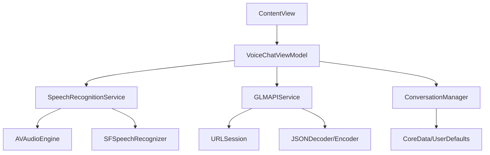

# Design Document

## Overview

The Voice AI Chat application is a SwiftUI-based iOS app that provides seamless voice interaction with the GLM-4.5-Air model. The app follows MVVM architecture pattern and integrates iOS Speech Recognition framework with streaming HTTP requests to deliver real-time AI conversations.

The application consists of a main chat interface with voice recording capabilities, real-time speech-to-text conversion, streaming API communication with GLM-4.5-Air, and a conversation history display.

## Architecture

### High-Level Architecture



### MVVM Pattern Implementation

- **View Layer**: SwiftUI views handling user interface and user interactions
- **ViewModel Layer**: ObservableObject classes managing state and business logic
- **Model Layer**: Data models and service classes for API communication and speech recognition
- **Service Layer**: Dedicated services for speech recognition, API communication, and data persistence

## Components and Interfaces

### 1. Core View Components

#### VoiceChatView (Main Interface)
- Primary chat interface with conversation history
- Voice recording button with visual feedback
- Streaming text display area
- Error message display
- Loading states and animations

#### ConversationBubbleView
- Individual message bubbles for user and AI responses
- Proper styling to distinguish message types
- Support for streaming text updates
- Timestamp display

#### VoiceRecordingButton
- Custom button with recording animation
- Visual feedback for recording states (idle, recording, processing)
- Haptic feedback integration
- Accessibility support

### 2. ViewModel Classes

#### VoiceChatViewModel
```swift
@MainActor
class VoiceChatViewModel: ObservableObject {
    @Published var messages: [ChatMessage] = []
    @Published var isRecording: Bool = false
    @Published var isProcessing: Bool = false
    @Published var currentStreamingResponse: String = ""
    @Published var errorMessage: String?
    
    // Dependencies
    private let speechService: SpeechRecognitionService
    private let apiService: GLMAPIService
    private let conversationManager: ConversationManager
}
```

### 3. Service Classes

#### SpeechRecognitionService
- Manages AVAudioEngine and SFSpeechRecognizer
- Handles microphone permissions
- Provides real-time speech-to-text conversion
- Error handling for speech recognition failures

#### GLMAPIService
- HTTP client for GLM-4.5-Air API communication
- Streaming response handling using URLSessionDataTask
- Authentication header management
- Request/response model encoding/decoding
- Rate limiting and error handling

#### ConversationManager
- Manages conversation history persistence
- Provides CRUD operations for chat messages
- Handles data synchronization
- Memory management for large conversations

## Data Models

### ChatMessage
```swift
struct ChatMessage: Identifiable, Codable {
    let id: UUID
    let content: String
    let isFromUser: Bool
    let timestamp: Date
    let isStreaming: Bool
}
```

### GLMRequest
```swift
struct GLMRequest: Codable {
    let model: String = "glm-4.5-air"
    let messages: [GLMMessage]
    let stream: Bool = true
    let temperature: Double = 0.7
    let maxTokens: Int = 1000
}

struct GLMMessage: Codable {
    let role: String
    let content: String
}
```

### GLMStreamResponse
```swift
struct GLMStreamResponse: Codable {
    let id: String
    let object: String
    let created: Int
    let model: String
    let choices: [GLMChoice]
}

struct GLMChoice: Codable {
    let index: Int
    let delta: GLMDelta
    let finishReason: String?
}

struct GLMDelta: Codable {
    let content: String?
    let role: String?
}
```

## API Integration Details

### GLM-4.5-Air API Configuration
- Base URL: `https://open.bigmodel.cn/api/paas/v4/chat/completions`
- Authentication: Bearer token in Authorization header
- Content-Type: `application/json`
- Streaming: Server-Sent Events (SSE) format

### Request Flow
1. Convert speech to text using iOS Speech Recognition
2. Create GLMRequest with conversation context
3. Send POST request with streaming enabled
4. Parse SSE responses and update UI incrementally
5. Handle completion and error states

### Response Parsing
- Parse Server-Sent Events format (`data: {...}`)
- Extract content deltas from streaming responses
- Accumulate partial responses for display
- Handle `[DONE]` completion signal

## Error Handling

### Speech Recognition Errors
- Microphone permission denied
- Speech recognition unavailable
- Audio input failures
- Network connectivity issues during recognition

### API Communication Errors
- Authentication failures (401)
- Rate limiting (429)
- Network timeouts
- Invalid response format
- Streaming interruption

### Error Recovery Strategies
- Automatic retry with exponential backoff
- Graceful degradation for partial responses
- User-friendly error messages
- Fallback to manual text input when speech fails

## Testing Strategy

### Unit Testing
- ViewModel logic testing with mock services
- API service testing with mock responses
- Speech recognition service testing with mock audio
- Data model serialization/deserialization testing

### Integration Testing
- End-to-end voice input to API response flow
- Streaming response handling
- Conversation persistence
- Error handling scenarios

### UI Testing
- Voice recording button interactions
- Conversation display and scrolling
- Error message display
- Loading state transitions

### Performance Testing
- Memory usage during long conversations
- Audio processing performance
- Network request efficiency
- UI responsiveness during streaming

## Security Considerations

### API Key Management
- Store API keys securely using iOS Keychain
- Never hardcode API keys in source code
- Implement key rotation capabilities

### Privacy Protection
- Request explicit microphone permissions
- Inform users about voice data processing
- Implement local speech processing when possible
- Secure conversation data storage

### Data Protection
- Encrypt conversation history at rest
- Implement secure network communication (HTTPS)
- Handle sensitive information appropriately
- Provide data deletion capabilities